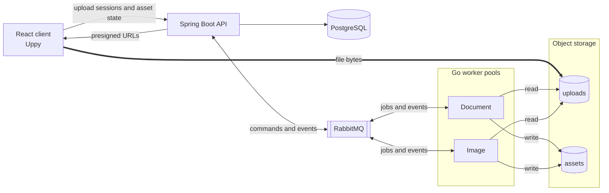
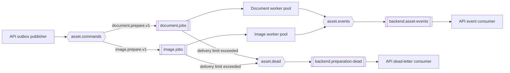
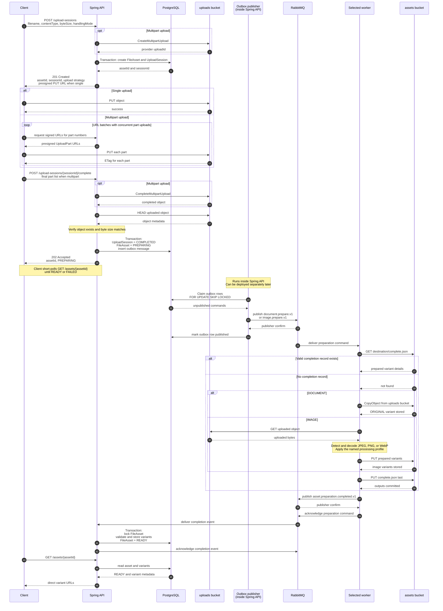
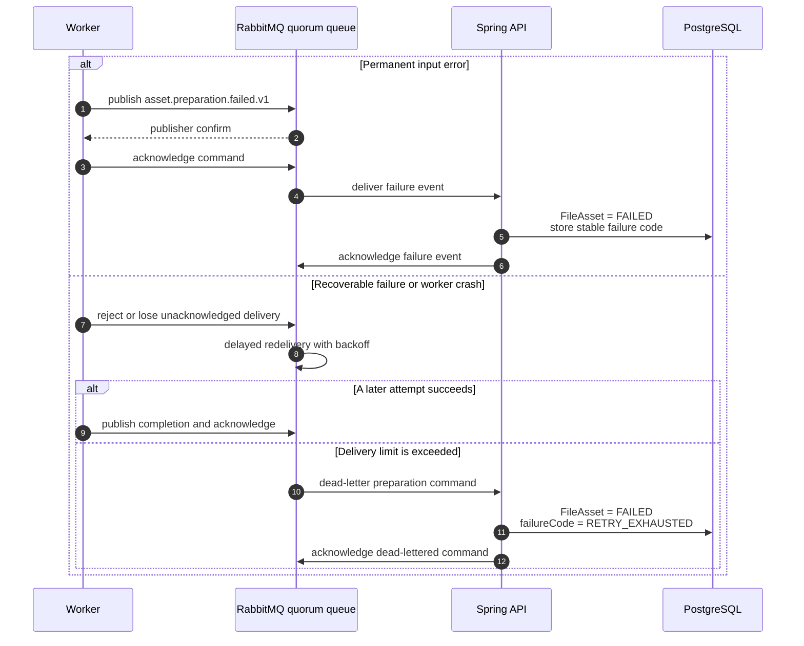

# Architecture

## System overview

The API handles metadata, authorization placeholders, upload coordination, and state. File bytes never pass through it. Clients upload directly to S3-compatible storage, and Go workers prepare uploaded objects asynchronously.

PostgreSQL stores file assets, upload sessions, asset variants, and outbox messages. One S3-compatible installation provides an `uploads` bucket for temporary input and an `assets` bucket for permanent output. Local development uses MinIO; a deployment can use S3 and a CDN.

### RabbitMQ routing

The publisher and consumers above run inside the Spring Boot API for now. They can be deployed separately later without changing the message contracts. Hexagons are exchanges; double-bordered boxes are queues.

## Upload and preparation sequence

For a single upload, the session response includes the presigned `PUT` URL. For multipart upload, the client requests presigned part URLs in batches, uploads those parts directly, and records the ETag returned for each part. The completion request carries the ordered part-number and ETag pairs, completes the multipart object, and then performs the same verification as a single upload. Calling completion again returns the existing result.

## Preparation

`DOCUMENT` accepts arbitrary bytes. The document worker performs a server-side copy into the `assets` bucket and returns one `ORIGINAL` variant. Large objects use multipart copy when the storage provider requires it.

`IMAGE` accepts static JPEG, PNG, and WebP. The image worker uses libvips through govips. A versioned profile owned by worker code produces:

| Variant | Output |
| --- | --- |
| `DISPLAY_SMALL` | WebP, maximum width 480 |
| `DISPLAY_MEDIUM` | WebP, maximum width 1280 |
| `DISPLAY_LARGE` | WebP, maximum width 1920 |
| `DOWNLOAD` | Optimized JPEG, or PNG when transparency is required |

Images are never upscaled. Several logical variants may reference the same stored object when the input is smaller than a profile size.

Spring assigns an opaque destination prefix such as `assets/{assetId}/`. The worker owns the names beneath it and returns object keys, content types, byte sizes, and image dimensions in the completion event. Spring validates that every key remains beneath the assigned prefix, but it does not issue a `HEAD` request for every output.

The uploaded object is not an asset variant. Workers write `complete.json` after every variant has been stored. On retry, it tells the worker that preparation already finished and provides the prepared variant details needed for the completion event. Clients never receive this file.

## Failure sequence

RabbitMQ 4.3 quorum queues provide delayed retry, a configurable delivery limit, consumer timeout, dead-lettering, and an `x-delivery-count` header. Workers use manual acknowledgements, and all event publishers wait for publisher confirms.

## State changes

A `FileAsset` moves from `AWAITING_UPLOAD` to `PREPARING` once its upload completes, then to `READY` after preparation. An upload or preparation failure moves it to `FAILED`. A valid completion arriving after retry exhaustion can still move it from `FAILED` to `READY`.

An `UploadSession` starts as `CREATED` and ends as `COMPLETED`, `ABORTED`, or `EXPIRED`.

## Consistency

- Creating an upload session accepts an `Idempotency-Key`. The unique business key is `(owner_id, idempotency_key)`. Reusing a key with different request data returns `409 Conflict`.
- Completing or aborting an upload session is idempotent.
- The outbox connects the database transaction to command publication. Every API instance may publish rows claimed with `FOR UPDATE SKIP LOCKED`.
- RabbitMQ delivery is at least once. Workers use deterministic output keys and check `complete.json` before repeating work.
- Completion handling locks the file asset and relies on a unique `(asset_id, variant_type)` constraint. Repeated equivalent events succeed. Conflicting events are rejected and reported.

## Cleanup and scaling

An object-storage lifecycle rule removes every source object from the `uploads` bucket after seven days. This covers completed, failed, and abandoned uploads.

A separate lifecycle rule aborts incomplete multipart uploads after one day. Until a multipart upload is completed or aborted, its uploaded parts remain stored even though there is no readable object yet.

A scheduled task in Spring claims old failed assets with `FOR UPDATE SKIP LOCKED`. After a grace period, it checks the state again and removes partial objects beneath the destination prefix. User-requested deletion of permanent assets is outside scope.

The API is stateless outside PostgreSQL. Document and image workers consume separate queues, so each pool can be scaled independently. RabbitMQ absorbs temporary backlogs. Queue depth, oldest message age, processing duration, failures, and dead letters are monitored. Autoscaling and Kubernetes are outside scope.

Clients receive direct object URLs built from the stored bucket and object key. Example uses opaque keys as unguessable public links. Signed read URLs and authorization can be added later.
